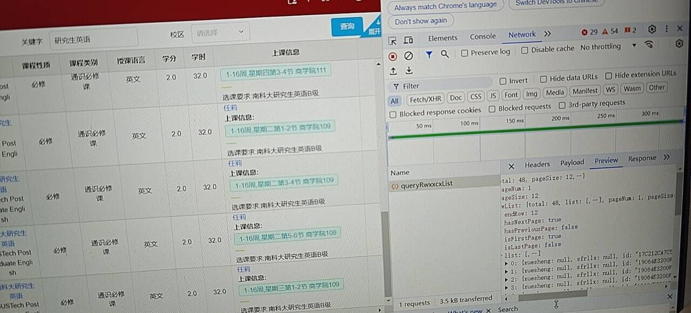

# SUSTech-CAS-ChooseCourse

1. 打开全校课表，筛选出自己想要的课。按照图示找到课程的p_id。(没有看到queryRwxxcxList的话重新点一下查询)

2. 随便选一门课，同样的方式找到addGouwuche请求，右键copy as fetch(nodejs)

3. 打开VSCode，新建一个js文件，将刚刚复制的代码粘贴进去，修改其中的cookie和body 字段中的 p_id，保存。

4. 到点执行
